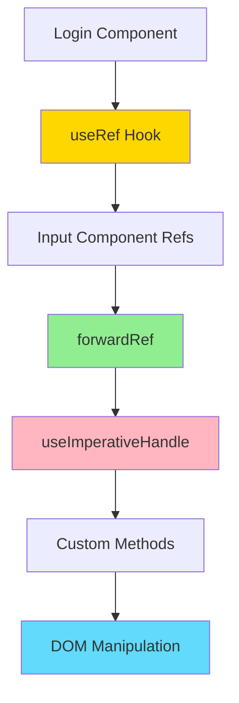
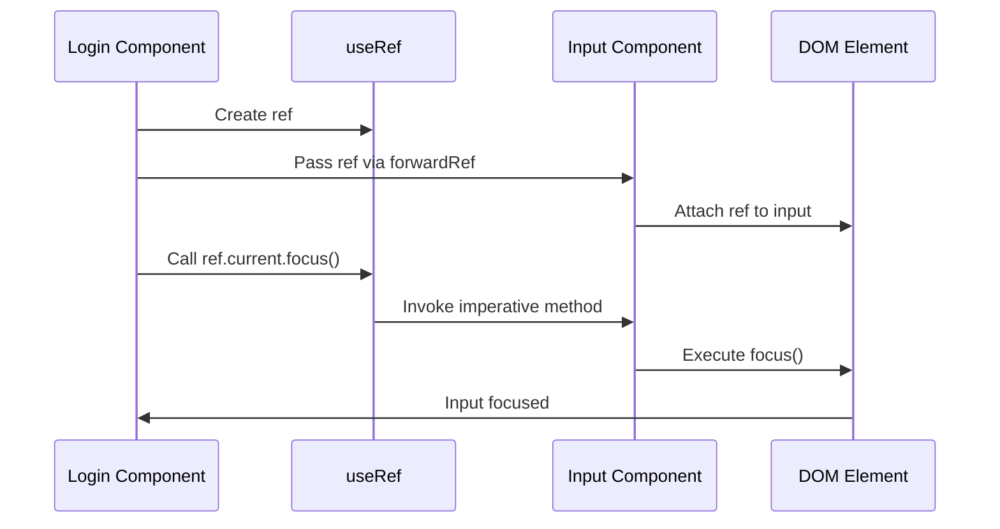
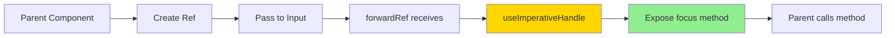

# Complex useRef Example

A React application demonstrating advanced `useRef` usage with `forwardRef` and `useImperativeHandle` for imperative DOM manipulation.

## Overview

This example shows how to use `useRef`, `forwardRef`, and `useImperativeHandle` to create reusable input components with imperative focus management.

## Architecture



## Features

- `useRef` for DOM element references
- `forwardRef` for ref forwarding to child components
- `useImperativeHandle` for exposing custom methods
- Imperative focus management
- Reusable Input component with ref support
- Form validation with focus control

## Ref Flow



## Getting Started

### Installation

```bash
npm install
```

### Running the Application

```bash
npm start
```

Open [http://localhost:3000](http://localhost:3000) to view it in the browser.

### Building for Production

```bash
npm run build
```

## Project Structure

```
src/
├── components/
│   ├── Home/
│   │   └── Home.jsx
│   ├── Login/
│   │   └── Login.jsx         # Uses refs
│   ├── MainHeader/
│   │   ├── MainHeader.jsx
│   │   └── Navigation.jsx
│   └── UI/
│       ├── Button/
│       ├── Card/
│       └── Input/
│           └── Input.jsx      # forwardRef component
├── context/
│   └── auth-context.js
├── App.jsx
└── index.jsx
```

## Key Concepts

### useRef Hook

Creates mutable ref objects that persist across renders without causing re-renders when changed.

### forwardRef

Allows functional components to receive refs from parent components and forward them to child elements.

### useImperativeHandle

Customizes the instance value exposed to parent components when using refs, providing controlled access to child component methods.

## Implementation Details

### Input Component with forwardRef



### Benefits

1. **Encapsulation**: Input component controls its own focus logic
2. **Reusability**: Input component can be used anywhere
3. **Imperative API**: Parent can imperatively control focus
4. **Controlled Exposure**: Only expose necessary methods

## Use Cases

- Focus management in forms
- Scroll control
- Animation triggers
- Media playback control
- Custom modal behaviors
- Imperative DOM operations

## Technologies Used

- React 17.0.2
- React Hooks (useRef, useImperativeHandle, useState, useEffect, useContext)
- forwardRef
- Context API
- CSS Modules

## Available Scripts

- `npm start` - Runs the app in development mode
- `npm test` - Launches the test runner
- `npm run build` - Builds the app for production
- `npm run eject` - Ejects from Create React App (one-way operation)

## Learn More

- [useRef Hook](https://reactjs.org/docs/hooks-reference.html#useref)
- [forwardRef API](https://reactjs.org/docs/react-api.html#reactforwardref)
- [useImperativeHandle Hook](https://reactjs.org/docs/hooks-reference.html#useimperativehandle)
- [Create React App documentation](https://facebook.github.io/create-react-app/docs/getting-started)

## Author

* **Or Assayag** - *Initial work* - [orassayag](https://github.com/orassayag)
* Or Assayag <orassayag@gmail.com>
* GitHub: https://github.com/orassayag
* StackOverflow: https://stackoverflow.com/users/4442606/or-assayag?tab=profile
* LinkedIn: https://linkedin.com/in/orassayag

## License

This application has an MIT License - see the [LICENSE](../../LICENSE) file for details.
