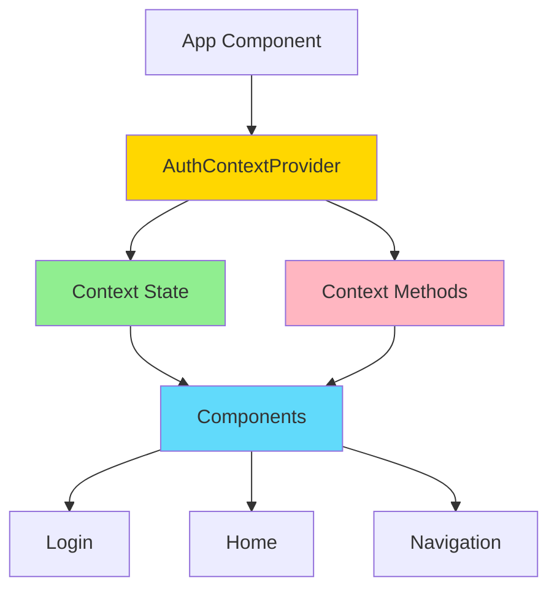
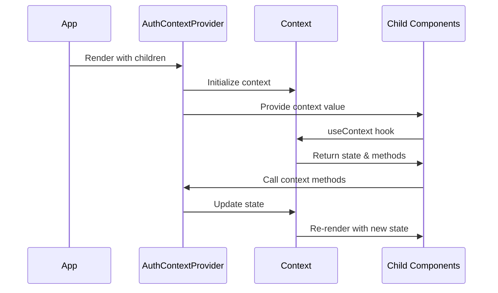

# Custom Context API Example

An advanced React application demonstrating a custom Context API provider pattern with improved organization and reusability.

## Overview

This example extends the basic Context API pattern by creating a custom provider component that encapsulates all authentication logic and state management.

## Architecture



## Features

- Custom Context Provider component
- Encapsulated authentication logic
- Cleaner component tree
- Improved code organization
- Type safety with default values
- Reusable authentication pattern

## Provider Pattern



## Getting Started

### Installation

```bash
npm install
```

### Running the Application

```bash
npm start
```

Open [http://localhost:3000](http://localhost:3000) to view it in the browser.

### Building for Production

```bash
npm run build
```

## Project Structure

```
src/
├── components/
│   ├── Home/
│   │   └── Home.jsx
│   ├── Login/
│   │   └── Login.jsx
│   ├── MainHeader/
│   │   ├── MainHeader.jsx
│   │   └── Navigation.jsx
│   └── UI/
│       ├── Button/
│       └── Card/
├── context/
│   └── auth-context.js      # Custom Provider Component
├── App.jsx                   # Uses AuthContextProvider
└── index.jsx
```

## Key Concepts

### Custom Provider Component

The `auth-context.js` file exports both:

1. The Context itself
2. A custom Provider component that manages all authentication logic

### Improved Component Hierarchy

Instead of managing state in `App.jsx`, all auth logic is encapsulated in `AuthContextProvider`, making `App.jsx` cleaner and more focused.

### Better Separation of Concerns

Authentication logic is completely separated from UI components, following the single responsibility principle.

## Comparison with Basic Context

| Feature           | Basic Context    | Custom Context        |
| ----------------- | ---------------- | --------------------- |
| State Management  | In App component | In Provider component |
| Logic Location    | Scattered        | Centralized           |
| Reusability       | Limited          | High                  |
| Testing           | Harder           | Easier                |
| Code Organization | Coupled          | Decoupled             |

## Technologies Used

- React 17.0.2
- React Context API
- React Hooks (useState, useEffect, useContext)
- LocalStorage API
- CSS Modules

## Available Scripts

- `npm start` - Runs the app in development mode
- `npm test` - Launches the test runner
- `npm run build` - Builds the app for production
- `npm run eject` - Ejects from Create React App (one-way operation)

## Learn More

- [React Context Documentation](https://reactjs.org/docs/context.html)
- [Context Provider Pattern](https://kentcdodds.com/blog/how-to-use-react-context-effectively)
- [Create React App documentation](https://facebook.github.io/create-react-app/docs/getting-started)

## Author

- **Or Assayag** - _Initial work_ - [orassayag](https://github.com/orassayag)
- Or Assayag <orassayag@gmail.com>
- GitHub: https://github.com/orassayag
- StackOverflow: https://stackoverflow.com/users/4442606/or-assayag?tab=profile
- LinkedIn: https://linkedin.com/in/orassayag

## License

This application has an MIT License - see the [LICENSE](../../LICENSE) file for details.
