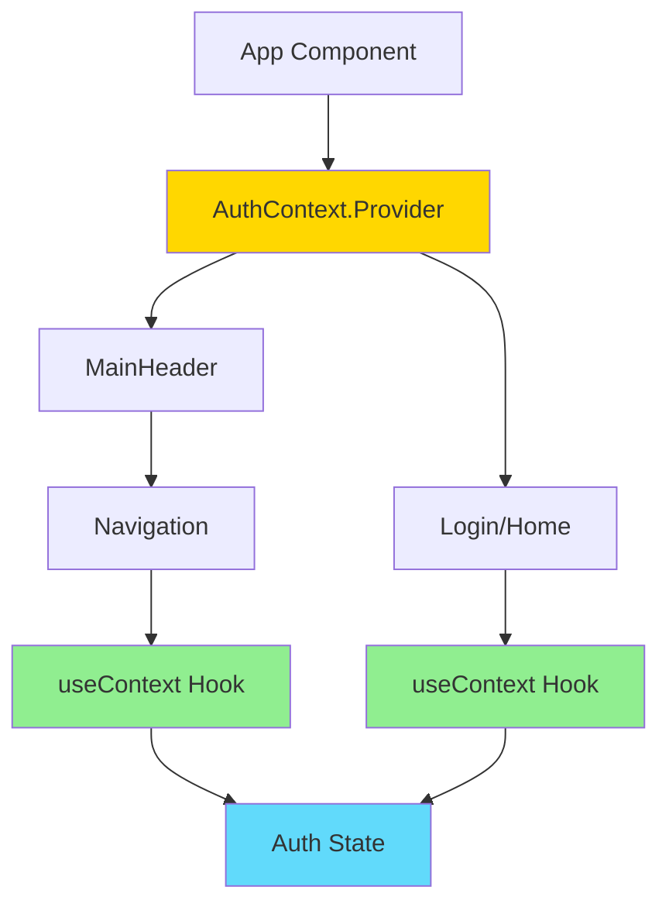
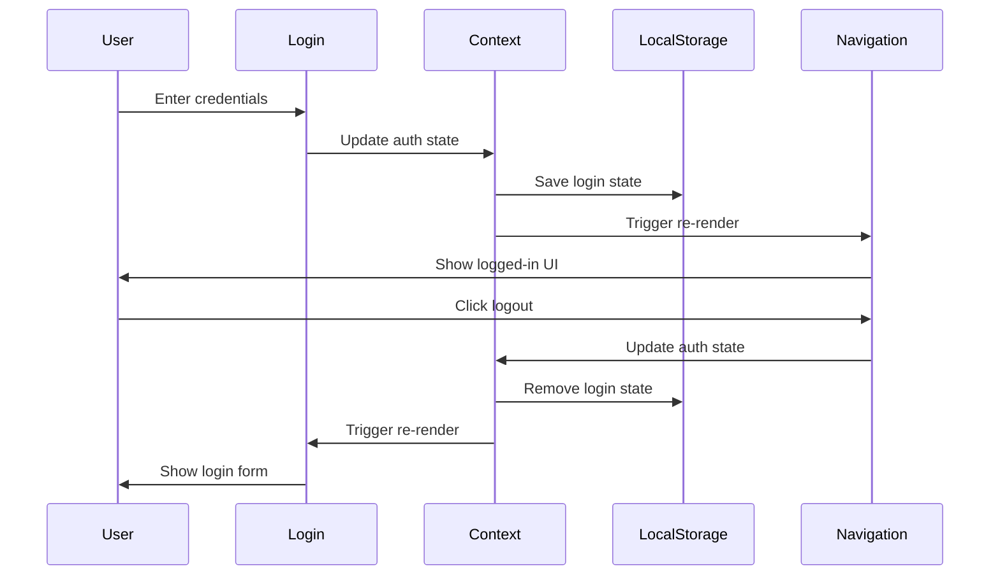

# Context API Example

A React application demonstrating the Context API for state management, eliminating the need for prop drilling.

## Overview

This example shows how to use React's Context API to manage authentication state across the application without passing props through every component level.

## Architecture



## Features

- Context API implementation for authentication
- Login/Logout functionality
- LocalStorage integration
- Protected routes pattern
- Context Consumer pattern

## Data Flow



## Getting Started

### Installation

```bash
npm install
```

### Running the Application

```bash
npm start
```

Open [http://localhost:3000](http://localhost:3000) to view it in the browser.

### Building for Production

```bash
npm run build
```

## Project Structure

```
src/
├── components/
│   ├── Home/
│   │   └── Home.jsx
│   ├── Login/
│   │   └── Login.jsx
│   ├── MainHeader/
│   │   ├── MainHeader.jsx
│   │   └── Navigation.jsx
│   └── UI/
│       ├── Button/
│       └── Card/
├── context/
│   └── auth-context.js      # Context definition
├── App.jsx                   # Context Provider setup
└── index.jsx
```

## Key Concepts

### Context Creation

The `auth-context.js` file creates a React Context that will hold authentication state.

### Provider Setup

The `App.jsx` component wraps the entire application with `AuthContext.Provider`, making the auth state available to all child components.

### Consuming Context

Components like `Navigation` and `MainHeader` consume the context using the `useContext` hook, avoiding the need for prop drilling.

## Technologies Used

- React 17.0.2
- React Context API
- React Hooks (useState, useEffect, useContext)
- LocalStorage API
- CSS Modules

## Available Scripts

- `npm start` - Runs the app in development mode
- `npm test` - Launches the test runner
- `npm run build` - Builds the app for production
- `npm run eject` - Ejects from Create React App (one-way operation)

## Learn More

- [React Context Documentation](https://reactjs.org/docs/context.html)
- [useContext Hook](https://reactjs.org/docs/hooks-reference.html#usecontext)
- [Create React App documentation](https://facebook.github.io/create-react-app/docs/getting-started)

## Author

* **Or Assayag** - *Initial work* - [orassayag](https://github.com/orassayag)
* Or Assayag <orassayag@gmail.com>
* GitHub: https://github.com/orassayag
* StackOverflow: https://stackoverflow.com/users/4442606/or-assayag?tab=profile
* LinkedIn: https://linkedin.com/in/orassayag

## License

This application has an MIT License - see the [LICENSE](../../LICENSE) file for details.
