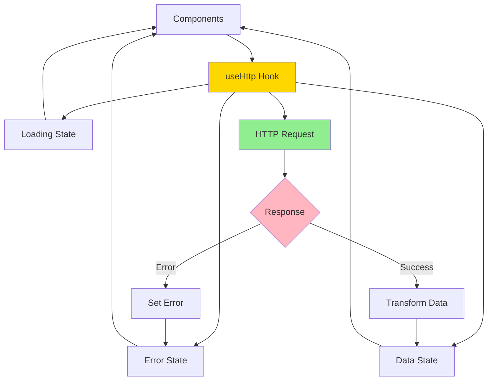
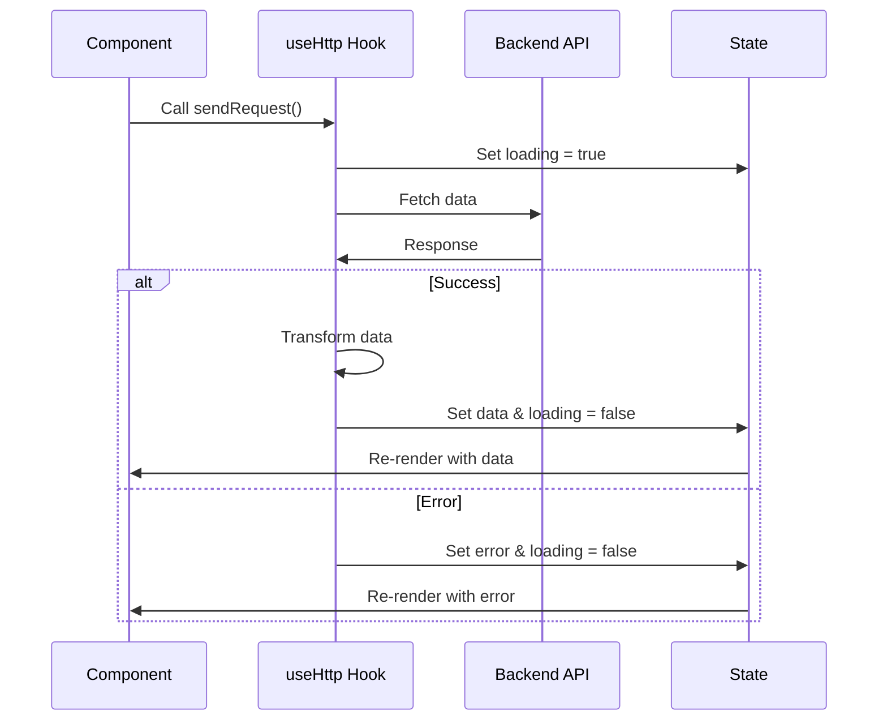
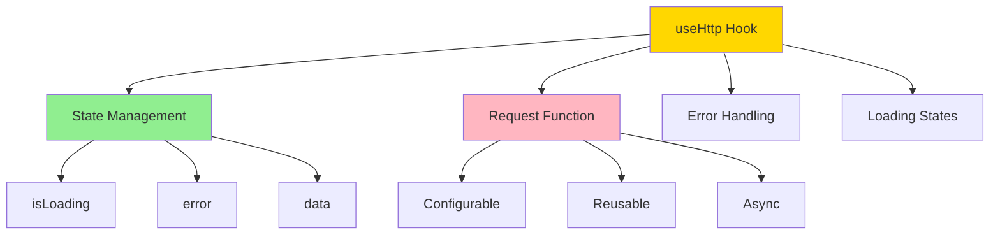
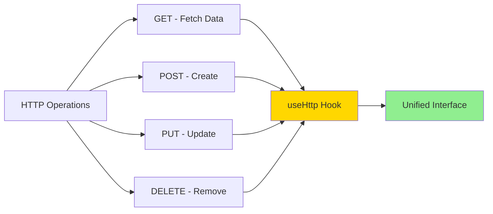

# HTTP Custom Hooks Example

A React application demonstrating a custom hook for handling HTTP requests with loading and error states.

## Overview

This example shows how to create a reusable `useHttp` hook that encapsulates all HTTP request logic, including loading states, error handling, and data transformation.

## Architecture



## Features

- Custom `useHttp` hook for API calls
- Automatic loading state management
- Comprehensive error handling
- Data transformation callback
- Reusable across components
- Clean separation of concerns
- Task management example

## HTTP Request Flow



## Getting Started

### Installation

```bash
npm install
```

### Running the Application

```bash
npm start
```

Open [http://localhost:3000](http://localhost:3000) to view it in the browser.

**Note**: This example requires a backend API. Update the Firebase URL in the code or set up your own backend.

### Building for Production

```bash
npm run build
```

## Project Structure

```
src/
├── components/
│   ├── NewTask/
│   │   ├── NewTask.js         # Uses useHttp
│   │   └── TaskForm.js
│   ├── Tasks/
│   │   ├── Tasks.js           # Uses useHttp
│   │   └── TaskItem.js
│   └── UI/
│       └── Section.js
├── hooks/
│   └── use-http.js            # Custom HTTP hook
├── App.js
└── index.js
```

## Key Concepts

### useHttp Hook Features



### Hook Benefits

1. **Reusability**: Use the same hook for GET, POST, PUT, DELETE
2. **Consistency**: Same loading/error pattern everywhere
3. **DRY Principle**: No repeated request logic
4. **Testability**: Easy to test in isolation
5. **Maintainability**: Single source of truth

### Usage Pattern

The hook returns:

- `isLoading`: Boolean indicating request status
- `error`: Error object if request fails
- `sendRequest`: Function to trigger the request

## Common HTTP Hook Patterns



## Error Handling

The hook provides comprehensive error handling:

- Network errors
- API errors
- Parsing errors
- Timeout handling
- User-friendly error messages

## Technologies Used

- React 17.0.2
- React Hooks (useState, useEffect, useCallback)
- Custom Hooks pattern
- Fetch API
- Firebase Realtime Database (example backend)
- CSS

## Available Scripts

- `npm start` - Runs the app in development mode
- `npm test` - Launches the test runner
- `npm run build` - Builds the app for production
- `npm run eject` - Ejects from Create React App (one-way operation)

## Learn More

- [Building Your Own Hooks](https://reactjs.org/docs/hooks-custom.html)
- [useCallback Hook](https://reactjs.org/docs/hooks-reference.html#usecallback)
- [Fetch API](https://developer.mozilla.org/en-US/docs/Web/API/Fetch_API)
- [Create React App documentation](https://facebook.github.io/create-react-app/docs/getting-started)

## Author

- **Or Assayag** - _Initial work_ - [orassayag](https://github.com/orassayag)
- Or Assayag <orassayag@gmail.com>
- GitHub: https://github.com/orassayag
- StackOverflow: https://stackoverflow.com/users/4442606/or-assayag?tab=profile
- LinkedIn: https://linkedin.com/in/orassayag

## License

This application has an MIT License - see the [LICENSE](../../LICENSE) file for details.
