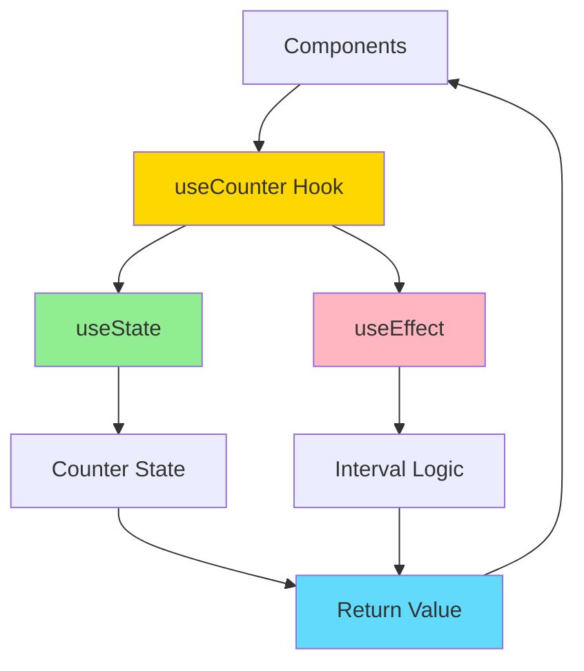
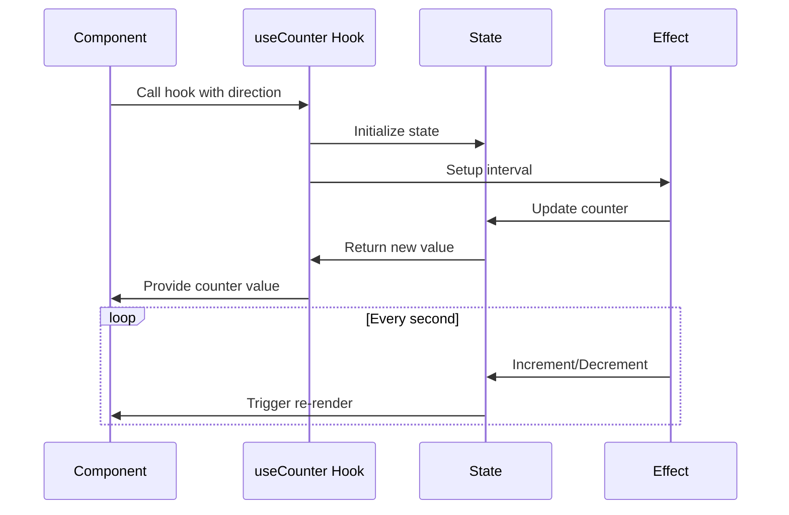
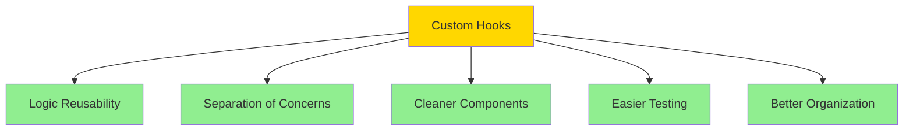

# Simple Custom Hooks Example

A React application demonstrating how to create and use custom hooks for extracting and reusing component logic.

## Overview

This example shows how to create a custom `useCounter` hook that encapsulates counter logic, allowing it to be reused in multiple components.

## Architecture



## Features

- Custom `useCounter` hook
- Reusable counter logic
- Forward counter component
- Backward counter component
- Configurable increment/decrement
- Automatic interval updates

## Hook Flow



## Getting Started

### Installation

```bash
npm install
```

### Running the Application

```bash
npm start
```

Open [http://localhost:3000](http://localhost:3000) to view it in the browser.

### Building for Production

```bash
npm run build
```

## Project Structure

```
src/
├── components/
│   ├── BackwardCounter.js     # Uses useCounter(false)
│   ├── ForwardCounter.js      # Uses useCounter(true)
│   └── Card.js
├── hooks/
│   └── use-counter.js         # Custom hook
├── App.js
└── index.js
```

## Key Concepts

### Custom Hook Pattern

Custom hooks allow you to extract component logic into reusable functions. They follow the "use" naming convention and can use other hooks.

### Benefits of Custom Hooks



### useCounter Hook

The custom hook:

- Accepts a `forwards` parameter
- Manages counter state internally
- Sets up interval for automatic updates
- Cleans up interval on unmount
- Returns the current counter value

## Use Cases for Custom Hooks

1. **Data Fetching**: Encapsulate API calls and loading states
2. **Form Handling**: Manage form state and validation
3. **Window Events**: Handle resize, scroll, etc.
4. **LocalStorage**: Sync state with localStorage
5. **Animation**: Manage animation states
6. **Timers**: Handle intervals and timeouts

## Technologies Used

- React 17.0.2
- React Hooks (useState, useEffect)
- Custom Hooks pattern
- CSS

## Available Scripts

- `npm start` - Runs the app in development mode
- `npm test` - Launches the test runner
- `npm run build` - Builds the app for production
- `npm run eject` - Ejects from Create React App (one-way operation)

## Learn More

- [Building Your Own Hooks](https://reactjs.org/docs/hooks-custom.html)
- [Rules of Hooks](https://reactjs.org/docs/hooks-rules.html)
- [Hooks API Reference](https://reactjs.org/docs/hooks-reference.html)
- [Create React App documentation](https://facebook.github.io/create-react-app/docs/getting-started)

## Author

- **Or Assayag** - _Initial work_ - [orassayag](https://github.com/orassayag)
- Or Assayag <orassayag@gmail.com>
- GitHub: https://github.com/orassayag
- StackOverflow: https://stackoverflow.com/users/4442606/or-assayag?tab=profile
- LinkedIn: https://linkedin.com/in/orassayag

## License

This application has an MIT License - see the [LICENSE](../../LICENSE) file for details.
