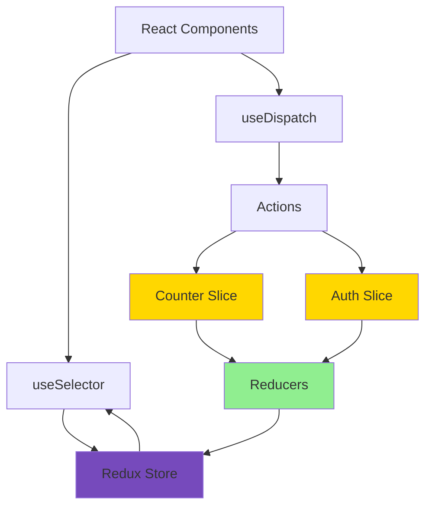
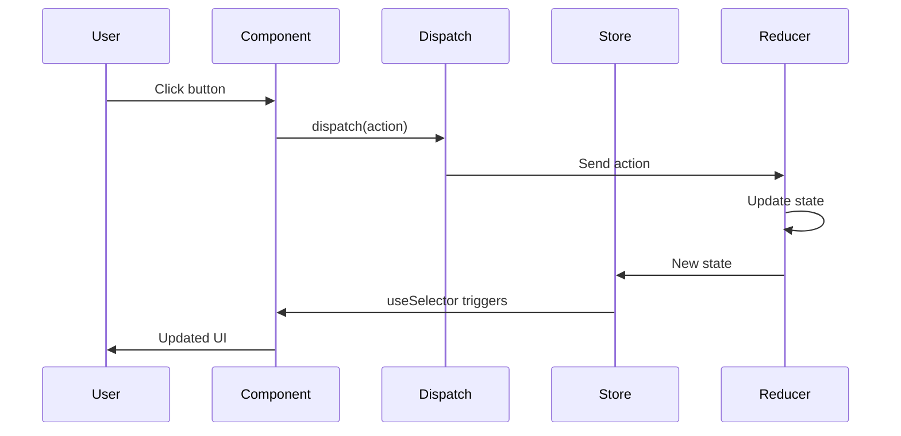
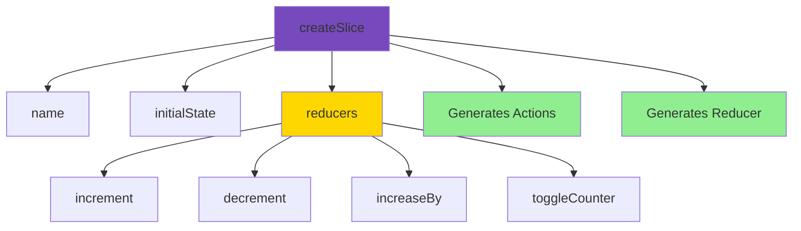
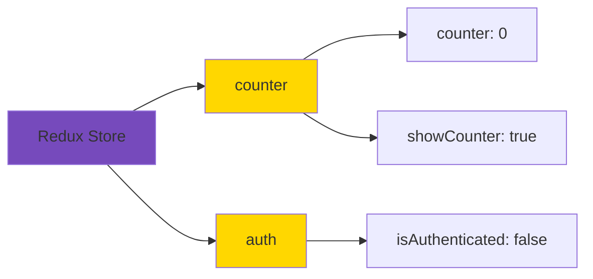
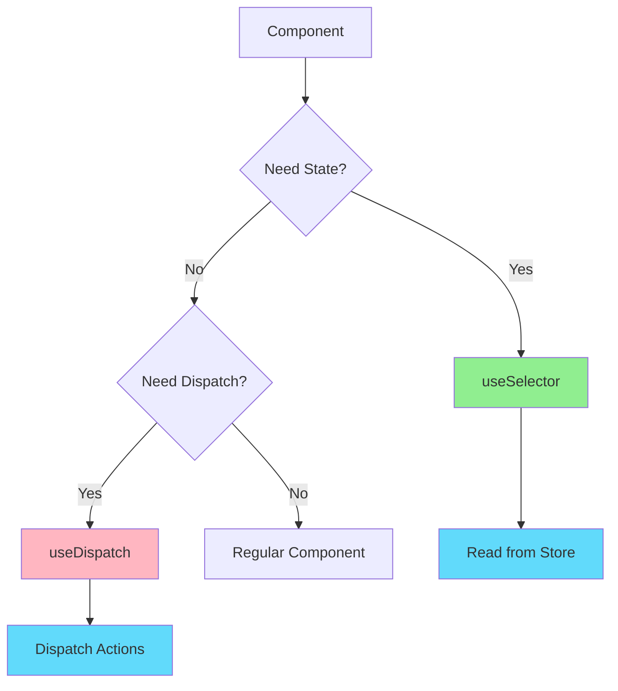

# Redux Counter Example

A React application demonstrating Redux Toolkit for state management with multiple slices and authentication flow.

## Overview

This example shows how to use Redux Toolkit to manage global state with separate slices for counter and authentication logic.

## Architecture



## Features

- Redux Toolkit setup
- Multiple slices (counter, auth)
- Counter with increment/decrement
- Counter increase by amount
- Toggle counter visibility
- Authentication flow
- Protected UI sections
- Modern Redux patterns

## Redux Flow



## Getting Started

### Installation

```bash
npm install
```

### Running the Application

```bash
npm start
```

Open [http://localhost:3000](http://localhost:3000) to view it in the browser.

### Building for Production

```bash
npm run build
```

## Project Structure

```
src/
├── components/
│   ├── Auth.js               # Login form
│   ├── Counter.js            # Counter with Redux
│   ├── CounterClass.js       # Class-based example
│   ├── Header.js             # Navigation
│   └── UserProfile.js        # Protected component
├── store/
│   ├── index.js              # Store configuration
│   ├── counter.js            # Counter slice
│   └── auth.js               # Auth slice
├── App.js
└── index.js
```

## Key Concepts

### Redux Toolkit Slices



### Store Configuration

The store combines multiple slices:
- **Counter Slice**: Manages counter state and logic
- **Auth Slice**: Manages authentication state

### Benefits of Redux Toolkit

1. **Less Boilerplate**: No action types or action creators needed
2. **Immutable Updates**: Built-in Immer for immutable state updates
3. **DevTools Integration**: Automatic Redux DevTools setup
4. **Type Safety**: Better TypeScript support
5. **Best Practices**: Enforces Redux best practices

## State Structure



## Component-Redux Integration



## Available Actions

### Counter Actions
- `increment()` - Increase counter by 1
- `decrement()` - Decrease counter by 1
- `increaseBy(amount)` - Increase by specific amount
- `toggleCounter()` - Show/hide counter

### Auth Actions
- `login()` - Set authenticated state
- `logout()` - Clear authenticated state

## Technologies Used

- React 17.0.2
- Redux Toolkit 1.5.1
- React Redux 7.2.4
- React Hooks (useSelector, useDispatch)
- CSS

## Available Scripts

- `npm start` - Runs the app in development mode
- `npm test` - Launches the test runner
- `npm run build` - Builds the app for production
- `npm run eject` - Ejects from Create React App (one-way operation)

## Learn More

- [Redux Toolkit Documentation](https://redux-toolkit.js.org/)
- [React Redux Hooks](https://react-redux.js.org/api/hooks)
- [Redux DevTools](https://github.com/reduxjs/redux-devtools)
- [Create React App documentation](https://facebook.github.io/create-react-app/docs/getting-started)

## Author

* **Or Assayag** - *Initial work* - [orassayag](https://github.com/orassayag)
* Or Assayag <orassayag@gmail.com>
* GitHub: https://github.com/orassayag
* StackOverflow: https://stackoverflow.com/users/4442606/or-assayag?tab=profile
* LinkedIn: https://linkedin.com/in/orassayag

## License

This application has an MIT License - see the [LICENSE](../../LICENSE) file for details.
