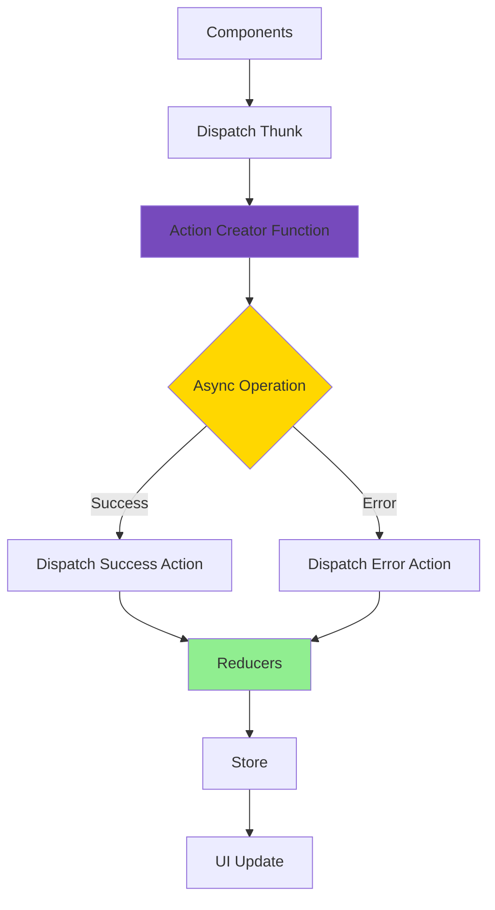
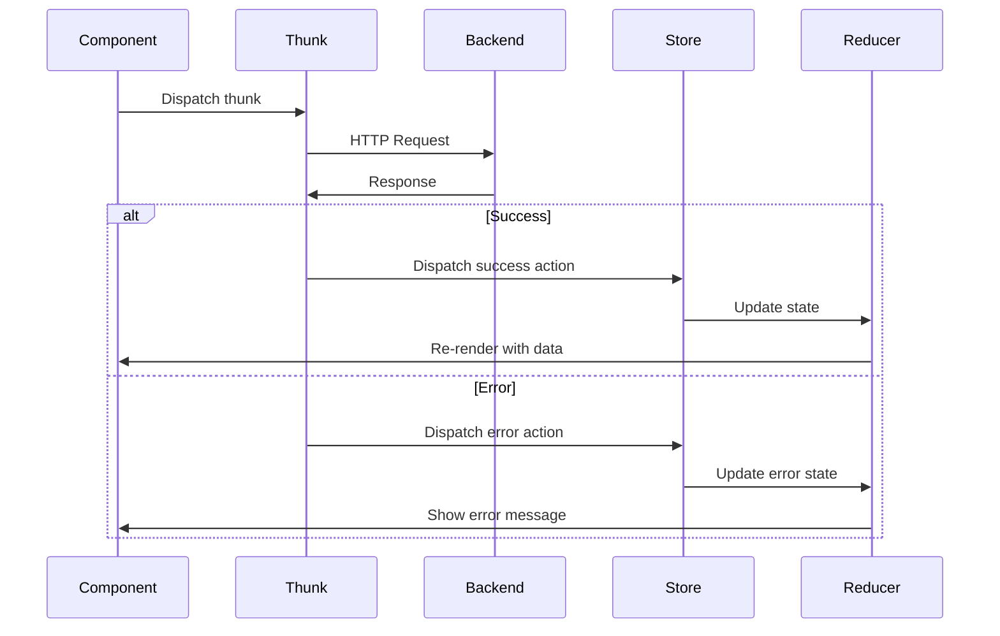
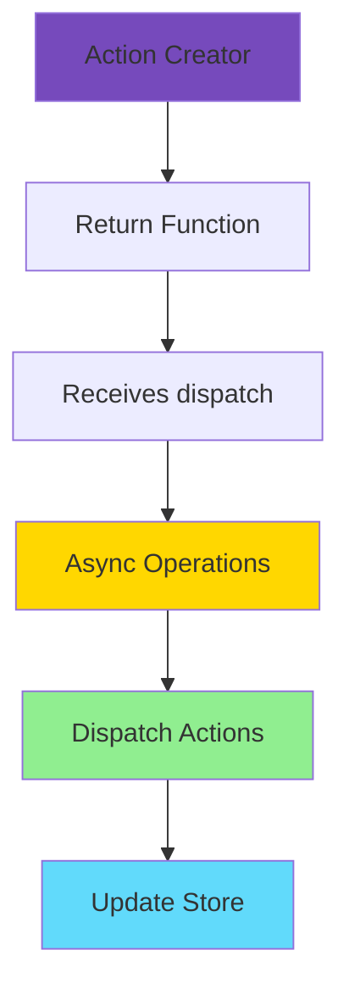
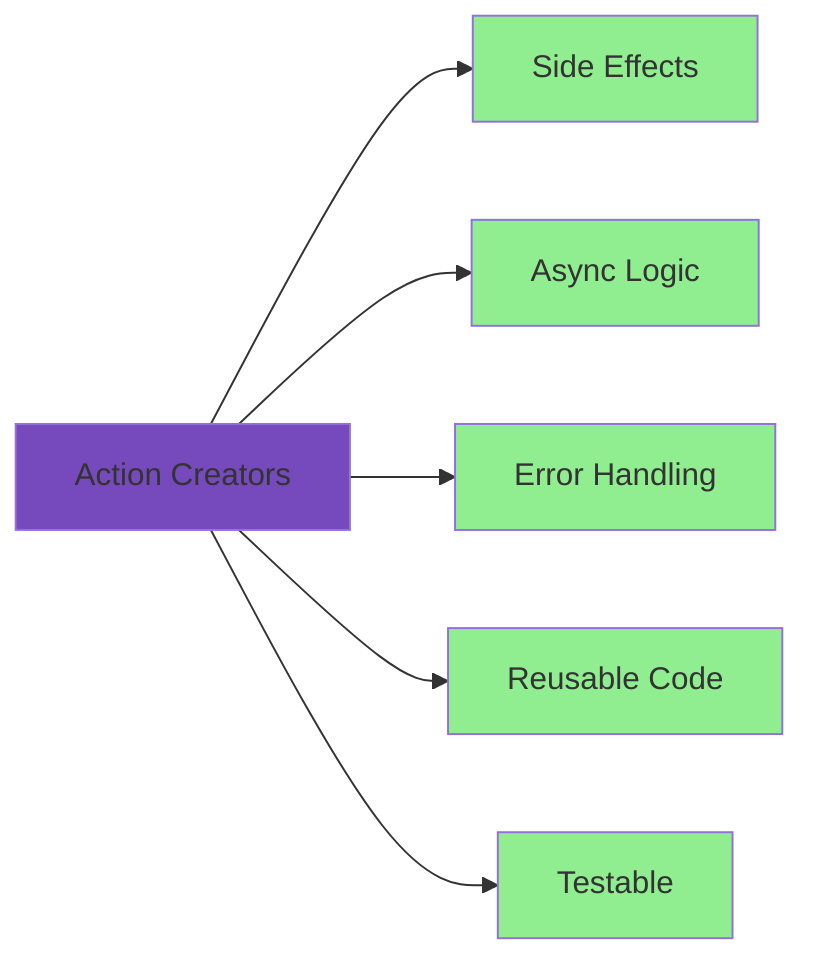
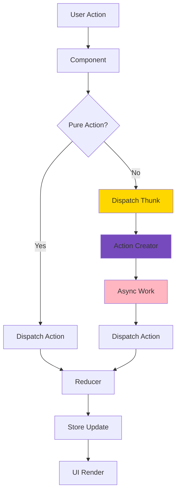

# Redux Shop with Action Creators

A shopping cart application demonstrating advanced Redux patterns with action creator functions for handling side effects.

## Overview

This example shows how to use Redux Toolkit action creators (thunks) to handle asynchronous operations and side effects outside of components.

## Architecture



## Features

- Redux Toolkit with action creators
- Shopping cart functionality
- Add/remove products
- HTTP requests with thunks
- Side effects in action creators
- Notification system
- Error handling
- Loading states

## Thunk Pattern Flow



## Getting Started

### Installation

```bash
npm install
```

### Running the Application

```bash
npm start
```

Open [http://localhost:3000](http://localhost:3000) to view it in the browser.

**Note**: This example requires a backend API. Update the Firebase URL or configure your own backend.

### Building for Production

```bash
npm run build
```

## Project Structure

```
src/
├── components/
│   ├── Cart/
│   │   ├── Cart.js
│   │   ├── CartButton.js
│   │   └── CartItem.js
│   ├── Layout/
│   │   ├── Layout.js
│   │   └── MainHeader.js
│   ├── Shop/
│   │   ├── Products.js
│   │   └── ProductItem.js
│   └── UI/
│       ├── Card.js
│       └── Notification.js
├── store/
│   ├── index.js              # Store configuration
│   ├── cart-slice.js         # Cart reducer
│   ├── cart-actions.js       # Thunk action creators
│   └── ui-slice.js           # UI state
├── App.js
└── index.js
```

## Key Concepts

### Action Creator Pattern



### Thunk Functions

Action creators return functions that:

1. Receive `dispatch` and `getState` as arguments
2. Perform async operations
3. Dispatch multiple actions
4. Handle errors
5. Manage side effects

### Benefits of Action Creators



## State Management

### Cart State

- Items array with products
- Total quantity
- Changed flag for sync

### UI State

- Cart visibility
- Notification status
- Loading states

## Data Flow with Thunks



## Available Actions

### Cart Actions (Thunks)

- `sendCartData()` - Sync cart to backend
- `fetchCartData()` - Load cart from backend

### Cart Slice Actions

- `addItemToCart(item)` - Add product to cart
- `removeItemFromCart(id)` - Remove product
- `replaceCart(cart)` - Replace entire cart

### UI Actions

- `showNotification(notification)` - Display message
- `toggle()` - Show/hide cart

## Error Handling

The application handles:

- Network errors
- API failures
- Invalid data
- Timeout errors
- User-friendly notifications

## Technologies Used

- React 17.0.2
- Redux Toolkit 1.5.1
- React Redux 7.2.4
- Redux Thunks
- Fetch API
- CSS

## Available Scripts

- `npm start` - Runs the app in development mode
- `npm test` - Launches the test runner
- `npm run build` - Builds the app for production
- `npm run eject` - Ejects from Create React App (one-way operation)

## Learn More

- [Redux Toolkit Thunks](https://redux-toolkit.js.org/api/createAsyncThunk)
- [Writing Logic with Thunks](https://redux.js.org/usage/writing-logic-thunks)
- [Redux Side Effects](https://redux.js.org/tutorials/fundamentals/part-6-async-logic)
- [Create React App documentation](https://facebook.github.io/create-react-app/docs/getting-started)

## Author

- **Or Assayag** - _Initial work_ - [orassayag](https://github.com/orassayag)
- Or Assayag <orassayag@gmail.com>
- GitHub: https://github.com/orassayag
- StackOverflow: https://stackoverflow.com/users/4442606/or-assayag?tab=profile
- LinkedIn: https://linkedin.com/in/orassayag

## License

This application has an MIT License - see the [LICENSE](../../LICENSE) file for details.
