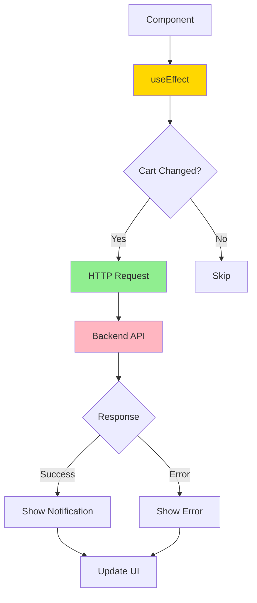
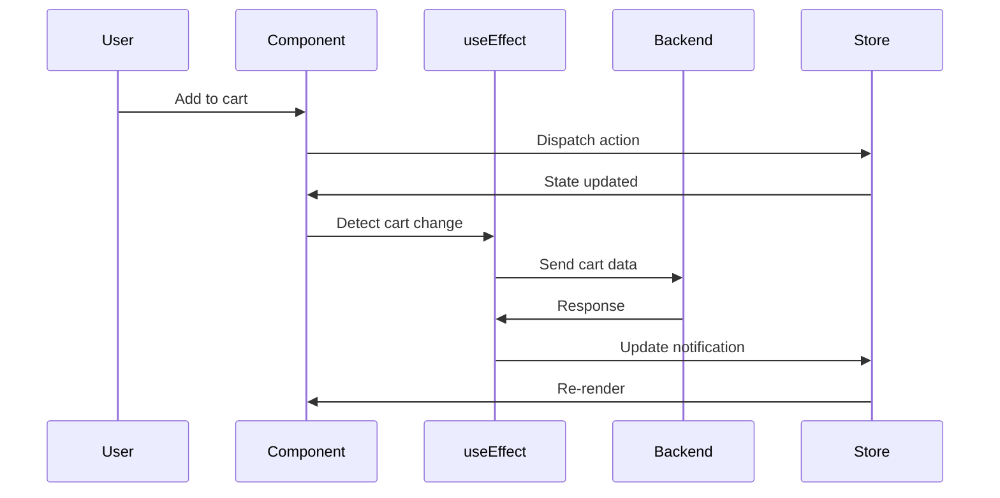
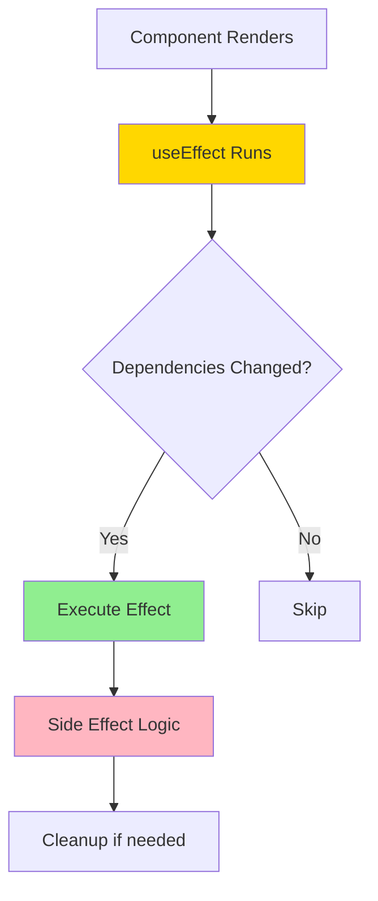
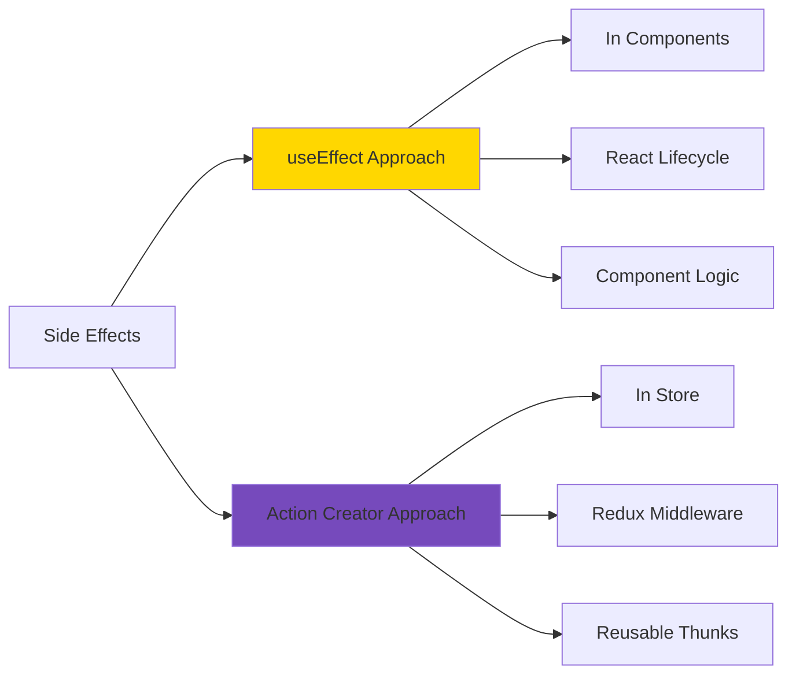
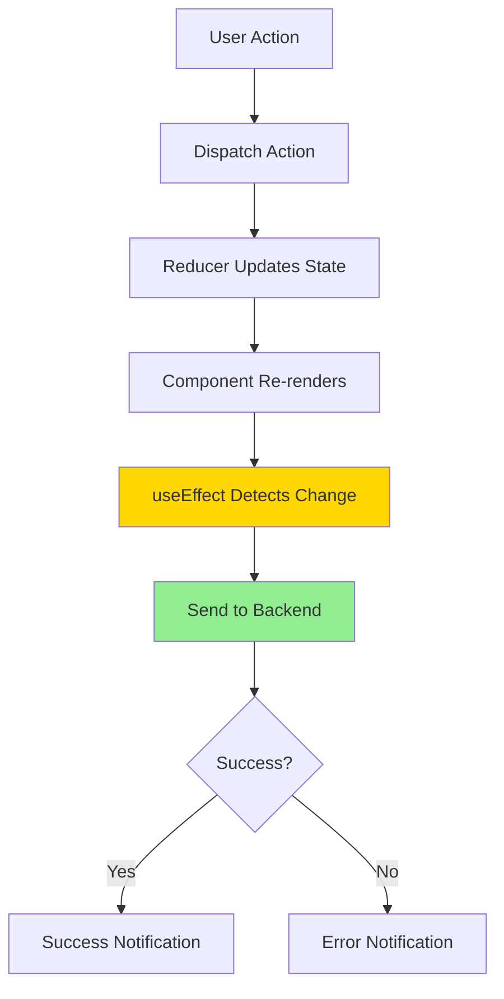
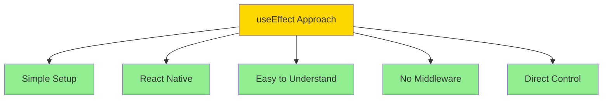

# Redux Shop with useEffect

A shopping cart application demonstrating side effects management in Redux using the useEffect hook for synchronization.

## Overview

This example shows an alternative approach to handling side effects in Redux by using the useEffect hook in components to synchronize cart data with a backend.

## Architecture



## Features

- Redux Toolkit for state management
- Shopping cart with add/remove
- useEffect for side effects
- Automatic cart synchronization
- HTTP requests in components
- Notification system
- Error handling
- Debounced sync

## useEffect Side Effects Pattern



## Getting Started

### Installation

```bash
npm install
```

### Running the Application

```bash
npm start
```

Open [http://localhost:3000](http://localhost:3000) to view it in the browser.

**Note**: This example requires a backend API. Update the Firebase URL or configure your own backend.

### Building for Production

```bash
npm run build
```

## Project Structure

```
src/
├── components/
│   ├── Cart/
│   │   ├── Cart.js
│   │   ├── CartButton.js
│   │   └── CartItem.js
│   ├── Layout/
│   │   ├── Layout.js
│   │   └── MainHeader.js
│   ├── Shop/
│   │   ├── Products.js
│   │   └── ProductItem.js
│   └── UI/
│       ├── Card.js
│       └── Notification.js
├── store/
│   ├── index.js              # Store configuration
│   ├── cart-slice.js         # Cart reducer
│   └── ui-slice.js           # UI state
├── App.js                     # useEffect for sync
└── index.js
```

## Key Concepts

### useEffect for Side Effects



### Synchronization Pattern

The App component uses useEffect to:
1. Watch cart state changes
2. Send cart data to backend
3. Handle success/error responses
4. Update notification state

### Component vs Action Creator Approach



## Comparison: useEffect vs Action Creators

| Aspect | useEffect | Action Creators |
|--------|-----------|----------------|
| **Location** | Component | Store/Actions |
| **Reusability** | Lower | Higher |
| **Testing** | Component test | Unit test |
| **Separation** | Coupled to component | Decoupled |
| **Complexity** | Simpler for small apps | Better for large apps |
| **React Integration** | Native React | Redux middleware |

## Data Flow



## State Management

### Cart State
- Items array with products
- Total quantity
- Changed flag

### UI State
- Cart visibility toggle
- Notification status and message

## Side Effects Handled

1. **Cart Synchronization**: Save cart to backend
2. **Notifications**: Show success/error messages
3. **Initial Load**: Fetch cart on mount
4. **Debouncing**: Prevent excessive API calls

## Benefits of This Approach



## Available Actions

### Cart Actions
- `addItemToCart(item)` - Add product to cart
- `removeItemFromCart(id)` - Remove product

### UI Actions
- `showNotification(notification)` - Display message
- `toggle()` - Show/hide cart

## Technologies Used

- React 17.0.2
- Redux Toolkit 1.5.1
- React Redux 7.2.4
- React Hooks (useEffect, useSelector, useDispatch)
- Fetch API
- CSS

## Available Scripts

- `npm start` - Runs the app in development mode
- `npm test` - Launches the test runner
- `npm run build` - Builds the app for production
- `npm run eject` - Ejects from Create React App (one-way operation)

## Learn More

- [useEffect Hook](https://reactjs.org/docs/hooks-effect.html)
- [Redux Side Effects](https://redux.js.org/tutorials/fundamentals/part-6-async-logic)
- [Fetching Data with useEffect](https://reactjs.org/docs/faq-ajax.html)
- [Create React App documentation](https://facebook.github.io/create-react-app/docs/getting-started)

## Author

* **Or Assayag** - *Initial work* - [orassayag](https://github.com/orassayag)
* Or Assayag <orassayag@gmail.com>
* GitHub: https://github.com/orassayag
* StackOverflow: https://stackoverflow.com/users/4442606/or-assayag?tab=profile
* LinkedIn: https://linkedin.com/in/orassayag

## License

This application has an MIT License - see the [LICENSE](../../LICENSE) file for details.
