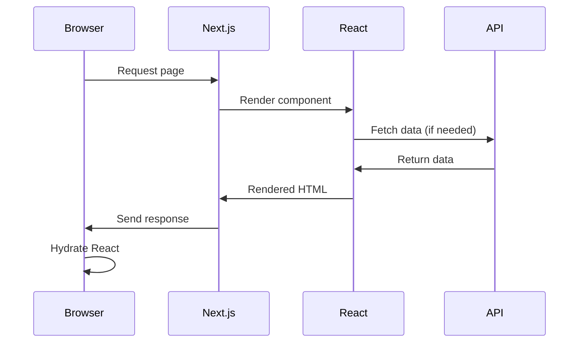

# Next.js Demo

A basic Next.js application demonstrating core concepts of the framework including file-based routing and server-side rendering.

## Overview

This example provides a simple introduction to Next.js, showcasing the fundamental features that make it a powerful React framework.

## Architecture

```mermaid
flowchart TD
    A[Browser] --> B[Next.js]
    B --> C[Pages Router]
    C --> D[index.js]
    C --> E[about.js]
    C --> F[API Routes]
    D --> G[Pre-rendered]
    E --> G
    F --> H[Serverless Functions]
    
    style B fill:#000000
    style C fill:#ffd700
    style G fill:#90EE90
    style H fill:#FFB6C1
```



## Features

- File-based routing system
- Server-side rendering (SSR)
- Static site generation (SSG)
- API routes
- Automatic code splitting
- Hot module replacement
- CSS support
- Image optimization

## File-Based Routing

```mermaid
graph TD
    A[pages/] --> B[index.js]
    A --> C[about.js]
    A --> D[api/hello.js]
    
    B --> E[Route: /]
    C --> F[Route: /about]
    D --> G[API: /api/hello]
    
    style A fill:#000000
    style B fill:#ffd700
    style C fill:#ffd700
    style D fill:#90EE90
```



## Getting Started

### Installation

```bash
npm install
```

### Running Development Server

```bash
npm run dev
```

Open [http://localhost:3000](http://localhost:3000) with your browser to see the result.

### Building for Production

```bash
npm run build
npm start
```

## Project Structure

```
pages/
├── index.js              # Home page (/)
├── about.js              # About page (/about)
└── api/
    └── hello.js          # API endpoint (/api/hello)

public/
├── favicon.ico
└── vercel.svg

styles/
├── globals.css
└── Home.module.css
```

## Key Concepts

### Pages

Every file in the `pages/` directory becomes a route:
- `pages/index.js` → `/`
- `pages/about.js` → `/about`
- `pages/blog/post.js` → `/blog/post`

### API Routes

Files in `pages/api/` become API endpoints:
- `pages/api/hello.js` → `/api/hello`

### Rendering Methods

```mermaid
flowchart LR
    A[Next.js Pages] --> B[SSG]
    A --> C[SSR]
    A --> D[CSR]
    
    B --> E[getStaticProps]
    C --> F[getServerSideProps]
    D --> G[useEffect]
    
    style A fill:#000000
    style B fill:#90EE90
    style C fill:#ffd700
    style D fill:#FFB6C1
```



### Static Generation (SSG)

Pre-render pages at build time:

```javascript
export async function getStaticProps() {
  return {
    props: { data }
  }
}
```

### Server-Side Rendering (SSR)

Render on each request:

```javascript
export async function getServerSideProps(context) {
  return {
    props: { data }
  }
}
```

## Next.js Features

```mermaid
graph TD
    A[Next.js] --> B[Zero Config]
    A --> C[TypeScript Support]
    A --> D[Fast Refresh]
    A --> E[Image Optimization]
    A --> F[Font Optimization]
    A --> G[Built-in CSS]
    
    style A fill:#000000
    style B fill:#90EE90
    style C fill:#90EE90
    style D fill:#90EE90
    style E fill:#90EE90
    style F fill:#90EE90
    style G fill:#90EE90
```



## Request Flow



## Editing Pages

You can start editing pages by modifying files in the `pages/` directory. The page auto-updates as you edit the file.

### Example: Home Page

Edit `pages/index.js` to customize the home page.

### Example: API Route

Access `pages/api/hello.js` at [http://localhost:3000/api/hello](http://localhost:3000/api/hello).

## Styling Options

Next.js supports multiple styling solutions:

```mermaid
graph LR
    A[Styling] --> B[CSS Modules]
    A --> C[Global CSS]
    A --> D[Sass]
    A --> E[CSS-in-JS]
    A --> F[Tailwind]
    
    style A fill:#000000
    style B fill:#90EE90
    style C fill:#90EE90
    style D fill:#90EE90
    style E fill:#90EE90
    style F fill:#90EE90
```



## Performance Optimizations

Next.js automatically optimizes:
- Code splitting per page
- Image lazy loading
- Font optimization
- JavaScript bundling
- CSS minification

## Technologies Used

- Next.js 10.2.0
- React 17.0.2
- React DOM 17.0.2
- Node.js
- CSS Modules

## Available Scripts

- `npm run dev` - Start development server at [http://localhost:3000](http://localhost:3000)
- `npm run build` - Build for production
- `npm start` - Run production server

## Deployment

### Deploy on Vercel

The easiest way to deploy is using [Vercel Platform](https://vercel.com/new?utm_medium=default-template&filter=next.js&utm_source=create-next-app&utm_campaign=create-next-app-readme):

```bash
vercel
```

### Other Platforms

Next.js can be deployed to:
- Netlify
- AWS
- Google Cloud
- Azure
- Digital Ocean
- Any Node.js hosting

## Learn More

To learn more about Next.js:

- [Next.js Documentation](https://nextjs.org/docs) - Learn about features and API
- [Learn Next.js](https://nextjs.org/learn) - Interactive tutorial
- [Next.js GitHub](https://github.com/vercel/next.js/) - Source code and examples

## Common Next.js Patterns

```mermaid
flowchart TD
    A[Next.js Apps] --> B[Blog]
    A --> C[E-commerce]
    A --> D[Dashboard]
    A --> E[Marketing Site]
    A --> F[Documentation]
    
    style A fill:#000000
    style B fill:#90EE90
    style C fill:#90EE90
    style D fill:#90EE90
    style E fill:#90EE90
    style F fill:#90EE90
```



## Author

* **Or Assayag** - *Initial work* - [orassayag](https://github.com/orassayag)
* Or Assayag <orassayag@gmail.com>
* GitHub: https://github.com/orassayag
* StackOverflow: https://stackoverflow.com/users/4442606/or-assayag?tab=profile
* LinkedIn: https://linkedin.com/in/orassayag

## License

This application has an MIT License - see the [LICENSE](../../LICENSE) file for details.
