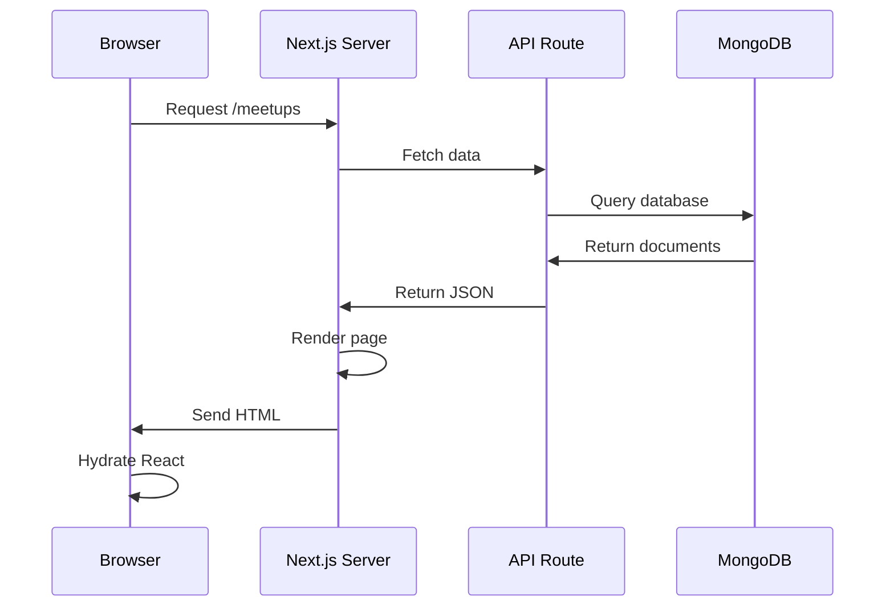
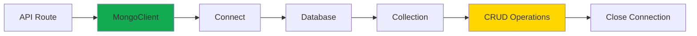

# Meetups App with Next.js

A full-stack meetups application built with Next.js, demonstrating server-side rendering, API routes, and MongoDB integration.

## Overview

This example shows how to build a complete web application using Next.js with file-based routing, data fetching, API routes, and database integration.

## Architecture

```mermaid
flowchart TD
    A[Browser] --> B[Next.js App]
    B --> C[Pages]
    B --> D[API Routes]
    C --> E[getStaticProps]
    C --> F[getServerSideProps]
    D --> G[MongoDB]
    E --> H[Pre-rendered HTML]
    F --> I[Server-rendered HTML]
    G --> D
    D --> C

    style B fill:#000000
    style C fill:#ffd700
    style D fill:#90EE90
    style G fill:#13AA52
```



## Features

- File-based routing
- Server-side rendering (SSR)
- Static site generation (SSG)
- API routes for backend
- MongoDB integration
- Form handling
- Dynamic routes
- Image optimization
- SEO-friendly pages
- Meetup CRUD operations

## Request Flow



## Getting Started

### Prerequisites

- MongoDB account or local MongoDB installation
- MongoDB connection string

### Installation

```bash
npm install
```

### Configuration

Update the MongoDB connection string in `pages/api/new-meetup.js` and other API routes.

### Running the Application

```bash
npm run dev
```

Open [http://localhost:3000](http://localhost:3000) to view it in the browser.

### Building for Production

```bash
npm run build
npm start
```

## Project Structure

```
pages/
├── index.js                  # Home page (list meetups)
├── new-meetup/
│   └── index.js             # Add new meetup form
├── [meetupId]/
│   └── index.js             # Dynamic meetup details
└── api/
    └── new-meetup.js        # API endpoint for creating meetups

components/
├── layout/
│   ├── Layout.js
│   └── MainNavigation.js
├── meetups/
│   ├── MeetupItem.js
│   ├── MeetupList.js
│   ├── MeetupDetail.js
│   └── NewMeetupForm.js
└── ui/
    └── Card.js
```

## Key Concepts

### File-Based Routing

```mermaid
graph TD
    A[pages/] --> B[index.js → /]
    A --> C[new-meetup/index.js → /new-meetup]
    A --> D["[meetupId]/index.js → /meetup-id"]
    A --> E[api/new-meetup.js → /api/new-meetup]

    style A fill:#000000
    style B fill:#ffd700
    style C fill:#ffd700
    style D fill:#90EE90
    style E fill:#FFB6C1
```



### Data Fetching Methods

Next.js provides different ways to fetch data:

```mermaid
flowchart TD
    A[Data Fetching] --> B[getStaticProps]
    A --> C[getServerSideProps]
    A --> D[getStaticPaths]
    A --> E[API Routes]

    B --> F[Build Time]
    C --> G[Request Time]
    D --> H[Dynamic Routes]
    E --> I[Backend Logic]

    style A fill:#000000
    style B fill:#90EE90
    style C fill:#ffd700
    style D fill:#FFB6C1
```



### getStaticProps

Pre-renders pages at build time. Best for:

- Content that doesn't change often
- SEO-important pages
- Fast page loads

### getServerSideProps

Renders pages on each request. Best for:

- Frequently changing data
- User-specific content
- Real-time data

### API Routes

Backend API endpoints in the same project:

- `/api/new-meetup` - Create meetup
- Serverless functions
- Full backend capabilities

## MongoDB Integration



### Database Operations

1. **Create**: Add new meetup via form
2. **Read**: List all meetups, view details
3. **Update**: Modify meetup (can be added)
4. **Delete**: Remove meetup (can be added)

## Pages Overview

### Home Page (`/`)

- Lists all meetups
- Uses `getStaticProps`
- Revalidates every 10 seconds

### New Meetup (`/new-meetup`)

- Form to add meetup
- Sends POST to `/api/new-meetup`
- Redirects after success

### Meetup Details (`/[meetupId]`)

- Dynamic route
- Uses `getStaticPaths` + `getStaticProps`
- Shows meetup details

## Rendering Strategies

```mermaid
flowchart TD
    A[Next.js Rendering] --> B[SSG - Static Generation]
    A --> C[SSR - Server Rendering]
    A --> D[ISR - Incremental Static]
    A --> E[CSR - Client Rendering]

    B --> F[Build Time]
    C --> G[Request Time]
    D --> H[Revalidate]
    E --> I[Client Side]

    style A fill:#000000
    style B fill:#90EE90
    style D fill:#ffd700
```



## Performance Benefits

```mermaid
graph LR
    A[Next.js] --> B[Code Splitting]
    A --> C[Image Optimization]
    A --> D[Fast Refresh]
    A --> E[Pre-rendering]
    A --> F[API Routes]

    style A fill:#000000
    style B fill:#90EE90
    style C fill:#90EE90
    style D fill:#90EE90
    style E fill:#90EE90
    style F fill:#90EE90
```



## SEO Optimization

Next.js provides:

- Pre-rendered HTML for search engines
- Meta tags support
- Automatic sitemap generation
- Server-side rendering
- Image optimization

## Technologies Used

- Next.js 10.2.0
- React 17.0.2
- React DOM 17.0.2
- MongoDB 3.6.6
- Node.js
- CSS Modules

## Available Scripts

- `npm run dev` - Starts development server
- `npm run build` - Creates production build
- `npm start` - Runs production server

## Deployment

Deploy to Vercel (creators of Next.js):

```bash
vercel
```

Or deploy to any Node.js hosting platform.

## Environment Variables

Create `.env.local`:

```
MONGODB_URI=your_mongodb_connection_string
```

## Learn More

- [Next.js Documentation](https://nextjs.org/docs)
- [Next.js API Routes](https://nextjs.org/docs/api-routes/introduction)
- [Data Fetching](https://nextjs.org/docs/basic-features/data-fetching)
- [MongoDB Node Driver](https://mongodb.github.io/node-mongodb-native/)

## Author

- **Or Assayag** - _Initial work_ - [orassayag](https://github.com/orassayag)
- Or Assayag <orassayag@gmail.com>
- GitHub: https://github.com/orassayag
- StackOverflow: https://stackoverflow.com/users/4442606/or-assayag?tab=profile
- LinkedIn: https://linkedin.com/in/orassayag

## License

This application has an MIT License - see the [LICENSE](../../LICENSE) file for details.
