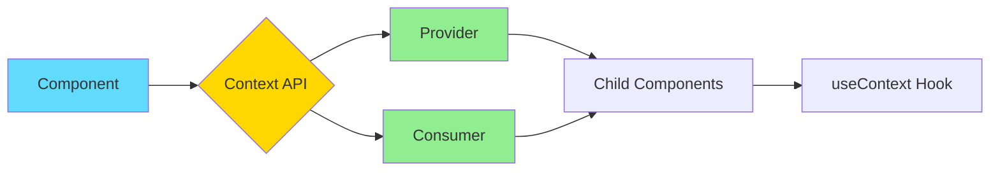
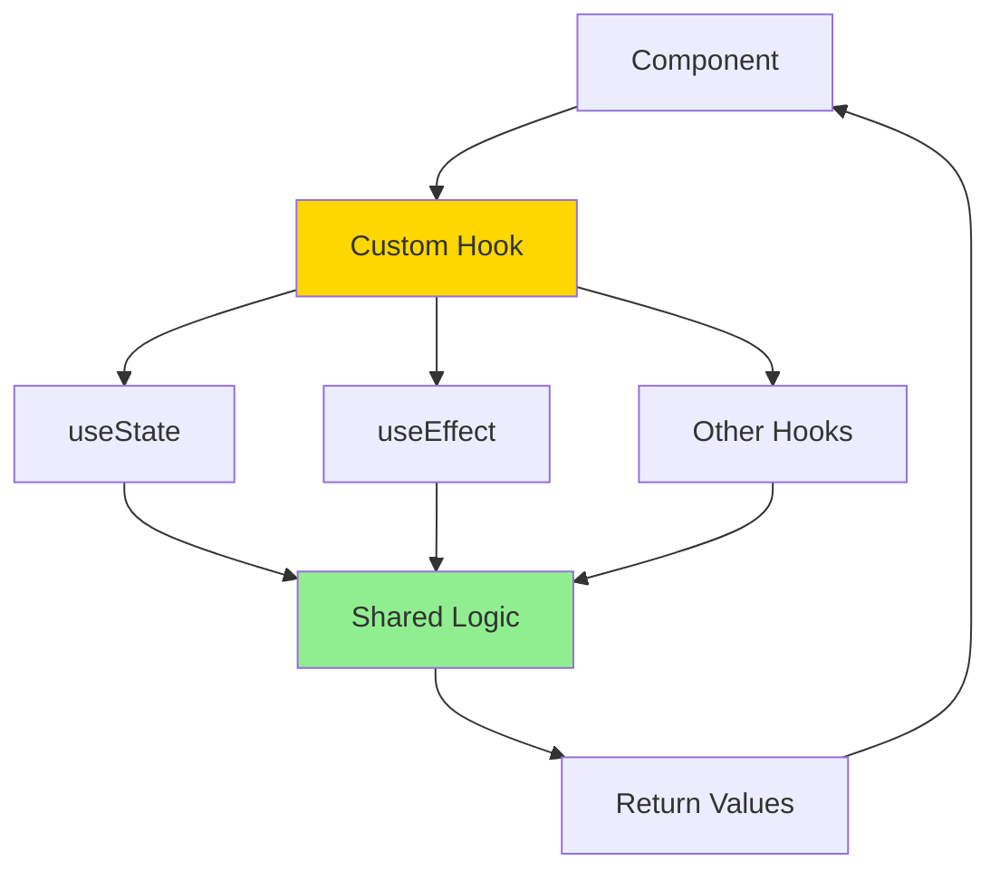
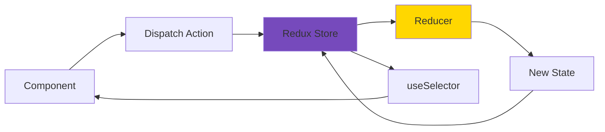
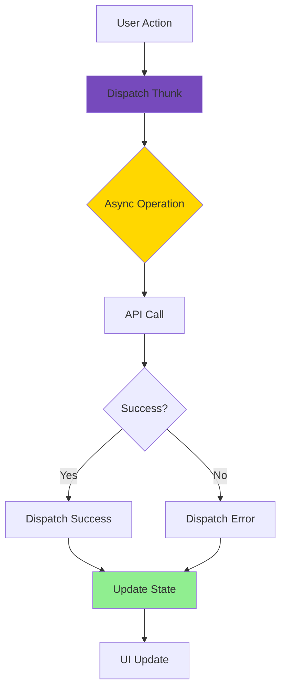
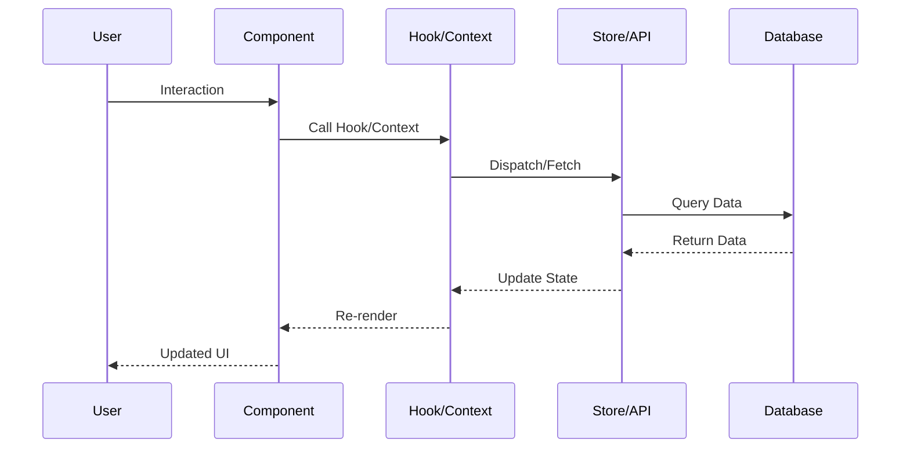

# React Learning V2

A comprehensive collection of React examples and demonstrations built as part of the 'React - The Complete Guide (incl Hooks, React Router, Redux)' course by Academind by Maximilian Schwarzmüller.

Built in May 2021. This repository contains hands-on examples covering React fundamentals, advanced hooks, Context API, custom hooks, Redux state management, and Next.js server-side rendering.

## Features

- 📚 Organized by course sections for easy navigation
- ⚛️ Modern React with Hooks and functional components
- 🔄 Redux Toolkit for state management
- 🎣 Custom hooks for reusable logic
- 🌐 Context API implementations
- 🚀 Next.js with server-side rendering
- 💾 MongoDB integration examples
- 🎨 Styled components and modular CSS

## Project Architecture

```mermaid
graph TD
    A[React Learning V2] --> B[Section 10: Advanced React]
    A --> C[Section 15: Custom Hooks]
    A --> D[Section 18: Redux Basics]
    A --> E[Section 19: Advanced Redux]
    A --> F[Section 22: Next.js]
    
    B --> B1[context-api]
    B --> B2[context-api-custom]
    B --> B3[complex-useRef]
    
    C --> C1[simple-custom-hooks]
    C --> C2[http-custom-hooks]
    
    D --> D1[counter]
    D --> D2[demo]
    
    E --> E1[shop-redux-action-creator]
    E --> E2[shop-redux-useeffect]
    
    F --> F1[meetups-v1]
    F --> F2[demo]
    
    style A fill:#61dafb
    style B fill:#ffd700
    style C fill:#ffd700
    style D fill:#764abc
    style E fill:#764abc
    style F fill:#000000
```



## Getting Started

### Prerequisites

- Node.js (v14 or higher)
- npm (comes with Node.js)
- Modern web browser
- Code editor (VSCode recommended)

### Installation

1. Clone the repository:
```bash
git clone https://github.com/orassayag/react-learning-v2.git
cd react-learning-v2
```

2. Navigate to the example you want to run:
```bash
cd <section-number>/<example-name>
```

3. Install dependencies:
```bash
npm install
```

4. Start the development server:
```bash
npm start
```

The application will open at `http://localhost:3000`

## Project Structure

```
react-learning-v2/
├── 10/                          # Advanced React Concepts
│   ├── context-api/            # Basic Context API
│   ├── context-api-custom/     # Custom Context Provider
│   └── complex-useRef/         # Advanced useRef
├── 15/                          # Custom Hooks
│   ├── simple-custom-hooks/    # Basic custom hooks
│   └── http-custom-hooks/      # HTTP request hooks
├── 18/                          # Redux Basics
│   ├── counter/                # Redux Toolkit counter
│   └── demo/                   # Basic Redux demo
├── 19/                          # Advanced Redux
│   ├── shop-redux-action-creator/  # Shopping cart
│   └── shop-redux-useeffect/       # Side effects
├── 22/                          # Next.js
│   ├── meetups-v1/             # Full meetups app
│   └── demo/                   # Next.js basics
└── README.md
```

## Examples Overview

### Section 10: Advanced React Concepts

Learn advanced React patterns and APIs:



#### context-api
Basic Context API implementation for state management without prop drilling.
- Context creation
- Provider setup
- Consumer usage
- Authentication state management

#### context-api-custom
Custom Context provider with advanced patterns.
- Custom provider component
- Context composition
- Optimized re-renders

#### complex-useRef
Advanced useRef usage with imperative handles.
- DOM manipulation
- forwardRef usage
- useImperativeHandle
- Focus management

### Section 15: Custom Hooks

Create reusable logic with custom hooks:



#### simple-custom-hooks
Basic custom hook patterns.
- useCounter hook
- Forward/Backward counters
- Logic reusability

#### http-custom-hooks
HTTP request handling with custom hooks.
- useHttp hook
- Loading states
- Error handling
- Data fetching

### Section 18: Redux Basics

Learn Redux state management fundamentals:



#### counter
Redux Toolkit implementation with authentication.
- Store setup
- Slices creation
- Multiple reducers
- Authentication logic

#### demo
Basic Redux demonstration.
- Simple state management
- Action dispatching
- State subscription

### Section 19: Advanced Redux

Advanced Redux patterns and side effects:



#### shop-redux-action-creator
Shopping cart with action creators.
- Action creator pattern
- Cart management
- Product handling
- Notifications

#### shop-redux-useeffect
Shopping cart with side effects.
- useEffect for side effects
- HTTP requests
- State synchronization

### Section 22: Next.js

Server-side rendering and static generation:

```mermaid
flowchart TD
    A[Request] --> B{Route Type}
    B -->|Static| C[getStaticProps]
    B -->|Dynamic| D[getServerSideProps]
    B -->|API| E[API Route]
    C --> F[Pre-rendered Page]
    D --> G[Server-rendered Page]
    E --> H[JSON Response]
    F --> I[Browser]
    G --> I
    H --> I
    
    style B fill:#000000
    style C fill:#90EE90
    style D fill:#ffd700
```



#### meetups-v1
Full meetups application.
- File-based routing
- API routes
- MongoDB integration
- Form handling
- Pre-rendering

#### demo
Basic Next.js demonstration.
- Pages and routing
- Data fetching
- SSR basics

## Technology Stack

### Core Technologies
- **React 17.0.2** - UI library
- **React DOM 17.0.2** - DOM rendering
- **React Hooks** - State and lifecycle management

### State Management
- **Redux Toolkit 1.5.1** - Modern Redux
- **React Redux 7.2.4** - React bindings for Redux
- **Context API** - Built-in state management

### Next.js Stack
- **Next.js 10.2.0** - React framework
- **MongoDB 3.6.6** - Database

### Build Tools
- **Webpack 4.44.2** - Module bundler
- **Babel** - JavaScript compiler
- **ESLint** - Code linting

### Testing
- **Jest 26.6.0** - Testing framework
- **Testing Library** - Component testing

## Available Scripts

Each example includes the following scripts:

### Create React App Examples

```bash
npm start       # Starts the development server
npm run build   # Creates a production build
npm test        # Runs the test suite
```

### Next.js Examples

```bash
npm run dev     # Starts the development server
npm run build   # Creates a production build
npm start       # Runs the production build
```

## Learning Path

Recommended order for working through the examples:

1. **Start with Context API** (Section 10)
   - Understand basic state management
   - Learn prop drilling alternatives

2. **Custom Hooks** (Section 15)
   - Extract reusable logic
   - Master hook composition

3. **Redux Basics** (Section 18)
   - Learn Redux Toolkit
   - Understand global state management

4. **Advanced Redux** (Section 19)
   - Handle side effects
   - Manage async operations

5. **Next.js** (Section 22)
   - Server-side rendering
   - Full-stack React applications

## Key Concepts Covered

### React Fundamentals
- Functional components
- Hooks (useState, useEffect, useReducer, useContext, useRef)
- Props and prop drilling
- Component composition
- Conditional rendering
- Lists and keys

### Advanced Patterns
- Context API for state management
- Custom hooks for logic reuse
- forwardRef and useImperativeHandle
- Render optimization
- Memoization

### Redux
- Store setup with Redux Toolkit
- Slices and reducers
- Action creators and thunks
- Connecting React components
- DevTools integration
- Side effects management

### Next.js
- File-based routing
- API routes
- getStaticProps and getServerSideProps
- Dynamic routes
- MongoDB integration
- Full-stack development

## Workflow Diagram



## Contributing

Contributions to this project are [released](https://help.github.com/articles/github-terms-of-service/#6-contributions-under-repository-license) to the public under the [project's open source license](LICENSE).

Everyone is welcome to contribute. Contributing doesn't just mean submitting pull requests—there are many different ways to get involved, including answering questions and reporting issues.

Please read [CONTRIBUTING.md](CONTRIBUTING.md) for details on our code of conduct and the process for submitting pull requests.

For detailed instructions on running and modifying the examples, see [INSTRUCTIONS.md](INSTRUCTIONS.md).

## Versioning

We use [SemVer](http://semver.org/) for versioning. For the versions available, see the [tags on this repository](https://github.com/orassayag/react-learning-v2/tags).

## Author

* **Or Assayag** - *Initial work* - [orassayag](https://github.com/orassayag)
* Or Assayag <orassayag@gmail.com>
* GitHub: https://github.com/orassayag
* StackOverflow: https://stackoverflow.com/users/4442606/or-assayag?tab=profile
* LinkedIn: https://linkedin.com/in/orassayag

## License

This application has an MIT License - see the [LICENSE](LICENSE) file for details.

## Acknowledgments

- Maximilian Schwarzmüller and Academind for the excellent course
- React team for the amazing library
- Redux team for Redux Toolkit
- Vercel team for Next.js
- The open-source community

## Resources

- [React Documentation](https://reactjs.org/)
- [Redux Toolkit Documentation](https://redux-toolkit.js.org/)
- [Next.js Documentation](https://nextjs.org/docs)
- [Course on Udemy](https://www.udemy.com/course/react-the-complete-guide-incl-redux/)

Happy learning! 🚀
